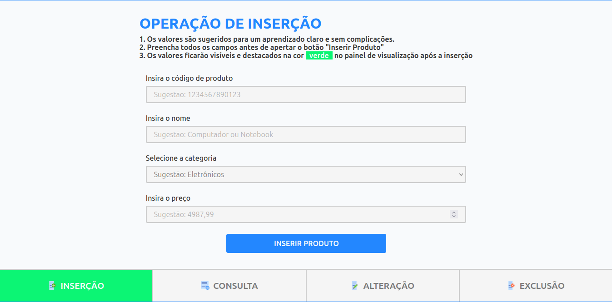
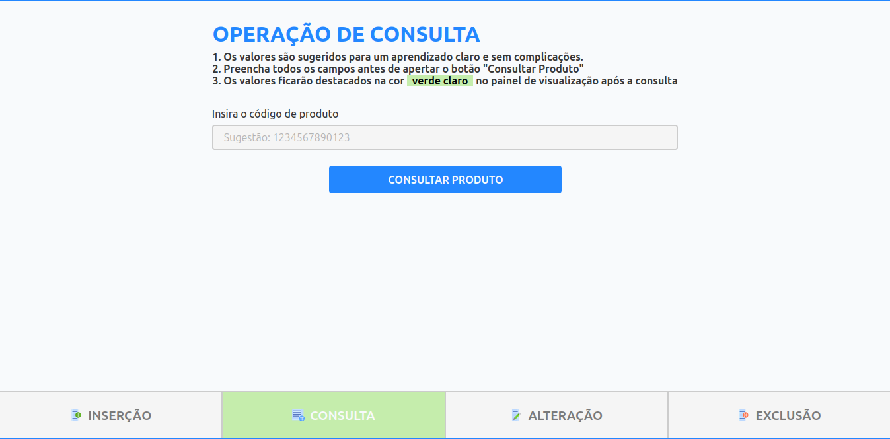
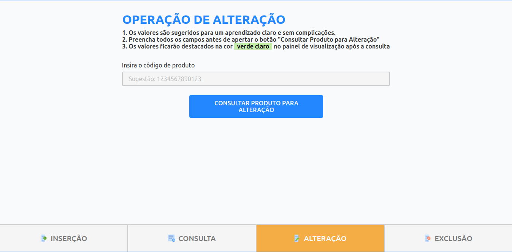
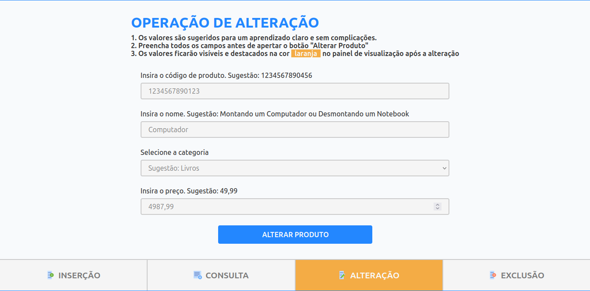
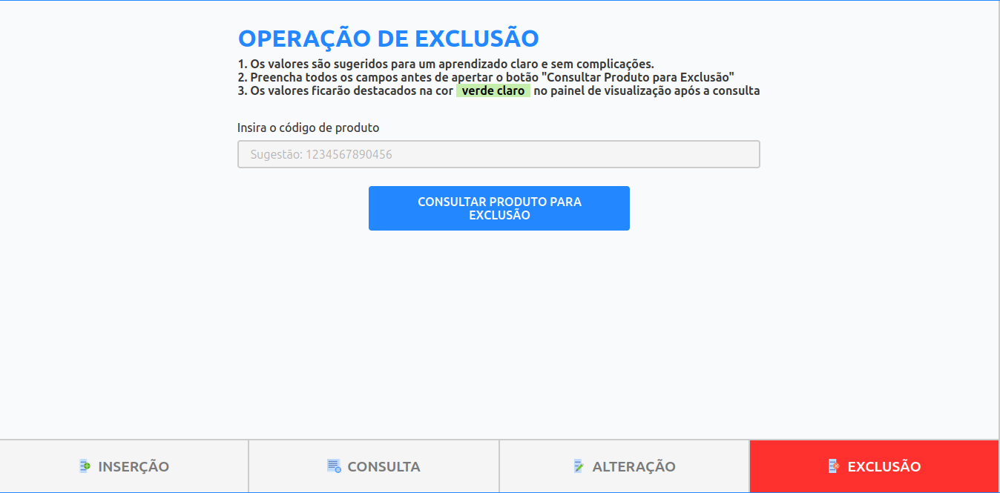
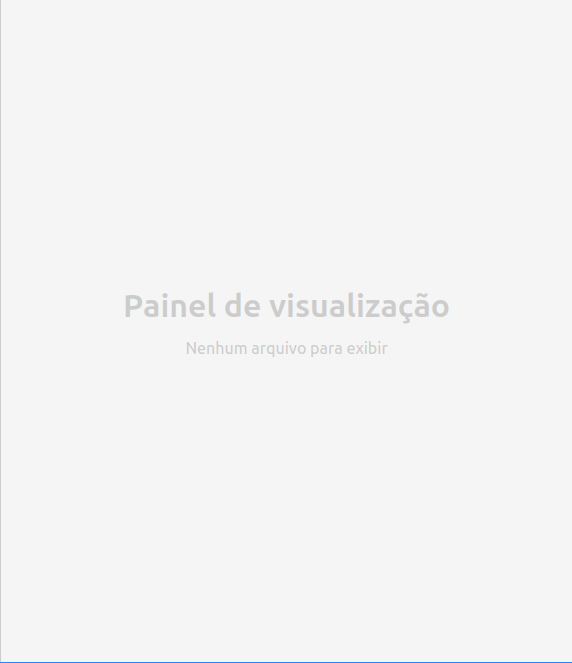
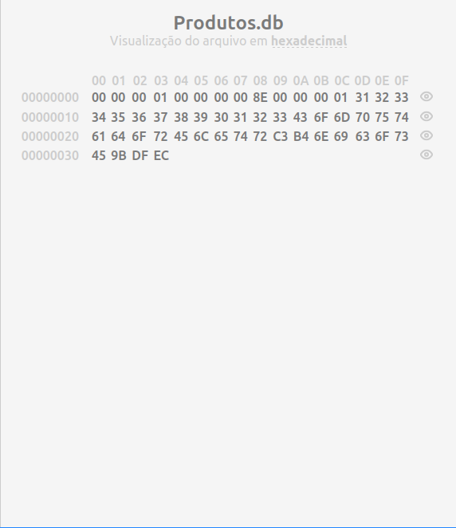
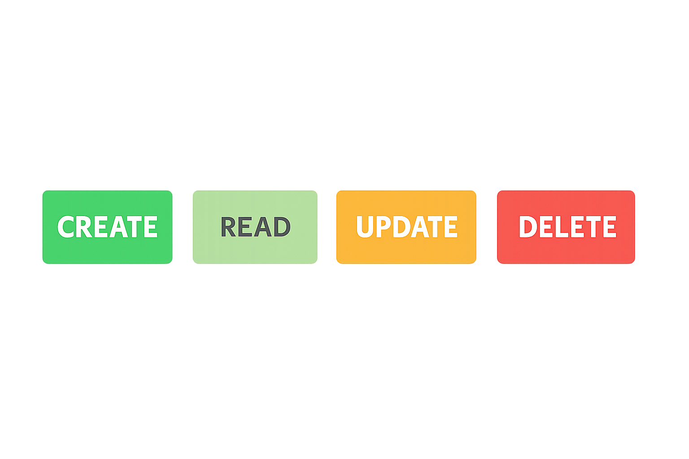

# 🖳 Simulador de Operações CRUD em Arquivos Estruturados
**Trabalho extensionista realizado na disciplina de AEDs III**

## 👨‍💻 Autores:
- **Alexandre Augusto Niess Ferreira**
- **Carlos Vinícius de Souza Coelho**
- **Lucas Araujo Barduino Rodrigues**
- **Marcos Paulo Miranda Pereira**

## 📹 Link para o vídeo de demonstração: [Clique aqui](https://youtu.be/RuJk4cwFUtw)

## 🌐 Link para o site: [Clique aqui](https://cavisc.github.io/simulador-de-operacoes-crud/)

 ### Este projeto foi desenvolvido com o objetivo de oferecer ao estudante de Ciência da Computação, uma visualização prática de como as operações fundamentais de CRUD (Create, Read, Update, Delete) impactam diretamente um arquivo estruturado em nível de bytes.

 ## 🔧 Funcionalidades Implementadas:

### Operações CRUD:

- #### **CREATE**: Inserir novos registros no arquivo

- #### **READ**: Buscar e visualizar registros existentes

- #### **UPDATE**: Modificar registros (com tratamento para campos de tamanho variável)

- #### **DELETE**: Remover registros usando marcação por lápide

### Painel de visualização

- #### **Nenhum produto cadastrado**:

- #### **Algum produto cadastrado**:

### Características Técnicas:

- Estratégia de lápide (tombstone) para exclusões

- Tratamento especial para atualizações: quando um registro maior é inserido, o registro antigo é marcado com lápide e o novo é escrito no final do arquivo

- Persistência via localStorage

- Visualização em tempo real da estrutura do arquivo destacando os registros manipulados pelas operações: 

    

## 👤 Avaliação de utilidade e usabilidade ([Resultados](https://docs.google.com/forms/d/1gqgBI8Z9zpwBa4Ilr3iUAaU5T4adpoVWq5fvtzSti9Q/edit#responses))

### Esta análise resume os resultados de um questionário aplicado a usuários do Simulador de Operações CRUD, avaliando tanto sua utilidade como ferramenta educacional quanto sua usabilidade na experiência prática.

### Utilidade

Quanto à utilidade, a aplicação foi consistentemente avaliada como muito útil para estudantes de Ciência da Computação. Os usuários confirmaram que o sistema efetivamente auxilia na compreensão de como os dados são armazenados em arquivos estruturados, com destaque para a visualização interativa do CRUD, que facilita significativamente o entendimento das operações. A capacidade de visualizar claramente a estrutura dos dados após cada operação foi particularmente valorizada, indicando que o simulador atinge seu objetivo educacional principal.

### Usabilidade

Na avaliação da usabilidade, a interface foi considerada intuitiva e de fácil utilização. As funções de inserir, consultar, alterar e excluir foram consideradas fáceis de encontrar e utilizar, e a organização dos elementos na tela foi elogiada por facilitar a realização das operações. O único aspecto que merece atenção é a clareza das mensagens do sistema (de sucesso ou erro), que recebeu avaliações ligeiramente inferiores, sugerindo uma oportunidade de melhoria pontual.

### Conclusão
Conclui-se que o Simulador de Operações CRUD é uma ferramenta educacional bem-sucedida, combinando alta utilidade para o aprendizado com boa usabilidade na interação prática. As avaliações positivas predominantes indicam que a aplicação cumpre efetivamente seu propósito, necessitando apenas de ajustes menores nas mensagens de feedback para otimizar ainda mais a experiência do usuário.

## 🗹 Checklist

### A página web com a visualização interativa do CRUD de produtos foi criada? Sim

### Há um vídeo de até 3 minutos demonstrando o uso da visualização? Sim

### O trabalho foi criado apenas com HTML, CSS e JS? Sim

### O relatório do trabalho foi entregue no APC? [Sim/Não]

### O trabalho está completo e funcionando sem erros de execução? Sim

### O trabalho é original e não a cópia de um trabalho de outro grupo? Sim
